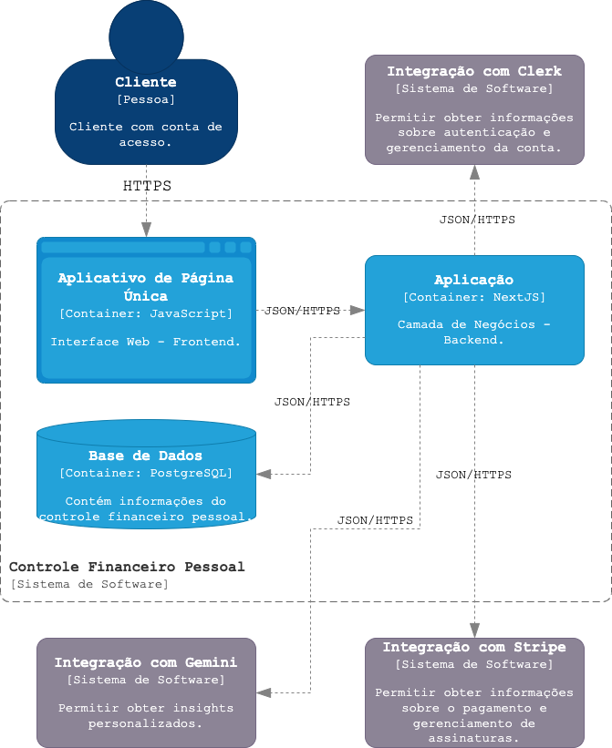
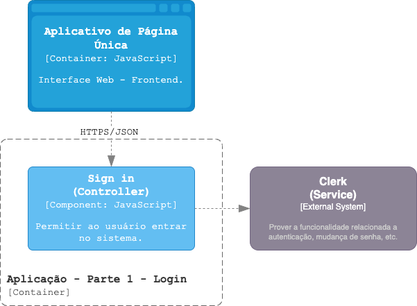

# CatolicaSC-Portfolio
Católica SC - Engenharia de Software - Portfólio

# Capa

- **Título do Projeto**: Controle Financeiro Pessoal com Avaliação de Investimentos.
- **Nome do Estudante**: Guilherme Victor Borges Pereira.
- **Curso**: Engenharia de Software.
- **Data de Entrega**: 28/06/2024.

# Resumo

Neste documento são apresentados o conceito e as funcionalidades do SmartFin, uma ferramenta de controle financeiro pessoal projetada para auxiliar na tomada de decisões sobre investimentos. O principal propósito do SmartFin é simular investimentos com base no perfil de risco dos usuários, além de oferecer uma plataforma para visualizar a saúde financeira. A ferramenta também permite controlar receitas e despesas e fornece um indicador rápido sobre a situação financeira mensal.

# Introdução

No mundo moderno, o controle financeiro pessoal está se tornando cada vez mais importante. Com pessoas interessadas em entender as diversas opções de investimento disponíveis e em quais investir, abra-se espaço a ferramentas que ajudem no controle das finanças e na tomada de decisões sobre investimentos. 

O desenvolvimento deste projeto se mostra altamente relevante para o campo da engenharia de software. Por meio da integração de tecnologias, como a inteligência artificial (IA), e do desenvolvimento de aplicações web para a apresentação de portfólios de investimento, o projeto busca fornecer aos usuários um controle financeiro melhor. Esta solução visa abordar os desafios enfrentados ao explorar novos investimentos no mercado financeiro. O objetivo final do projeto é oferecer uma ferramenta que ajude os interessados a controlarem suas finanças e a tomarem decisões informadas sobre investimentos.  

O texto está organizado como descrito a seguir. A Seção 1 contém os detalhes do tema do projeto, lista dos principais problemas que o projeto visa resolver e a delimitação dos problemas que o projeto não abordará. A Seção 2 aponta os requisitos do tema proposto, considerações de design, bem como a apresentação do modelo C4, Stack Tecnológica e Considerações de Segurança. A Seção 3 contém a descrição dos passos seguintes após a conclusão do documento.

## 1. Descrição do Projeto 

O tema do projeto é o desenvolvimento de uma ferramenta de controle financeiro pessoal com foco na avaliação de risco para listagem de opções de investimentos com a utilização de uma IA para análise e apresentação desse portifólio. O SmartFin será uma aplicação totalmente web que permitirá aos usuários controlarem e realizarem lançamentos de receitas e despesas. Essa tecnologia, busca avaliar o perfil de risco definido pelo usuário, utilizar um algoritmo de análise preditiva e apresentar algumas opções de tipos de investimentos como sugestões de aplicações. 

### 1.1. Problemas a Resolver 

Os principais problemas a serem abordados são: 

* controle e acompanhamento da saúde financeira; 
* organização na definição de tipos de despesas e receitas; 
* classificação do perfil de risco para investimentos; 
* recomendação personalizada de investimentos. 

### 1.2. Limitações 

É importante ressaltar as delimitações dos problemas que o projeto não abordará: 

* não abordará questões específicas de consultoria financeira; 
* não substituirá a orientação de um profissional financeiro qualificado; 
* não realizará aplicações em ações ou aportes dentro da plataforma; 
* não exportará os dados para análise externa; 
* não emitirá relatórios para realização de imposto de rende ou afins; 
* não terá integração com contas bancárias; 
* não importará transações e saldos externos ao aplicativo; 
* não oferecerá suporte aos demais idiomas, além do português brasileiro; 
* não oferecerá suporte de filtros para receitas e despesas lançadas; 
* não oferecerá suporte de pesquisa para receitas e despesas lançadas; 
* não será disponibilizado como uma aplicação móvel para dispositivos iOS e Android. 

## 2. Especificação Técnica 

Essa aplicação abordará uma arquitetura geral monolítica, utilizando como padrão de arquitetura para desenvolvimento web o modelo MVC (Model View Controller). A representação de design segue o modelo C4, com as três principais camadas, contexto, contêiner e componentes sendo representadas nesse documento, na seção 2.2.3. 

### 2.1. Requisitos de Software 

A seção de Requisitos de Software mostra os elementos funcionais e não-funcionais que compõem o software. Estes requisitos são essenciais para garantir que a aplicação atenda às necessidades dos usuários. O diagrama de caso de uso é abordado na seção 2.1.2. 

#### 2.1.1. Lista de Requisitos 

##### Requisitos Funcionais (RF): 

**Cadastrar Conta (RF1)**: O sistema deve permitir aos usuários realizarem o cadastro de suas contas.
**Realizar Login (RF2)**: O sistema deve permitir aos usuários autenticarem-se em suas contas.
**Realizar Autenticação (RF3)**: O sistema deve verificar as credenciais de login fornecidas pelos usuários (nome de usuário e senha) contra o banco de dados.
**Cadastrar Tipos (Receita/Despesa) (RF4)**: O sistema deve permitir aos usuários realizarem o cadastro dos tipos de receitas e despesas.
**Registrar Despesas/Receitas (RF5)**: O sistema deve permitir que os usuários registrem suas despesas e receitas de forma categorizada e detalhada.
**Calcular Saldo (RF6)**: O sistema deve calcular automaticamente o saldo atual com base nas despesas e receitas registradas pelos usuários.
**Visualizar Histórico Lançamentos (RF7)**: O sistema deve permitir que os usuários naveguem pelos lançamentos financeiros de meses anteriores.
**Visualizar Relatório Financeiro Gráfico (RF8)**: O sistema deve oferecer a visualização gráfica com detalhes do seu resultado mensal.
**Consultar Histórico Lançamentos (RF9)**: O sistema deve fornecer uma funcionalidade que consulta os lançamentos financeiros armazenados no banco de dados.
**Definir Perfil Risco (RF10)**: O sistema deve permitir que os usuários definam seu perfil de risco, que desejam assumir em seus investimentos.
**Simular Investimento (RF11)**: O sistema deve fornecer uma funcionalidade que permita aos usuários realizarem consultas às simulações de investimentos.
**Listar Opções Investimentos (RF12)**: O sistema deve fornecer aos usuários uma lista pequena de opções de investimento, incluindo algumas informações sobre cada uma delas.
**Realizar Análise Preditiva (RF13)**: O sistema deve empregar o modelo preditivo, para identificar padrões e tendências nos dados de investimentos.
**Consultar Base Dados (RF14)**: O sistema deve coletar e analisar dados históricos e atuais públicos de ações.
**Consultar Perfil Risco (RF15)**: O sistema deve considerar o perfil de usuário, para personalizar as recomendações. 

##### Requisitos Não-Funcionais (RNF): 

**Segurança (RNF1)**: O sistema deve garantir um acesso seguro ao usuário por meio da autenticação.
**Usabilidade (RNF2)**: O sistema deve ter uma interface de usuário intuitiva e amigável, facilitando a navegação e o uso por parte dos usuários.
**Desempenho (RNF3)**: O sistema deve ser capaz de manter um desempenho imediato nas respostas das operações.
**Manutenção (RNF4)**: O sistema deve ser fácil de manter e atualizar, com processos claros para implementar correções de bugs, adicionar recursos e garantir a compatibilidade com atualizações de sistemas operacionais e navegadores.
**Análise Preditiva em Investimentos (RNF5)**: O sistema deve utilizar um algoritmo de inteligência artificial para análise preditiva das opções de investimentos.
**Linguagens de Programação (RNF6)**: O sistema deve ser desenvolvido utilizando as seguintes linguagens de programação:

* para a implementação das funcionalidades do sistema principal, incluindo a interface do usuário e a lógica de negócios no lado do cliente e servidor, deve ser utilizado JavaScript; 
* para o desenvolvimento e integração de módulos de Inteligência Artificial (IA), utilizados para análise preditiva, recomendações financeiras e outros recursos baseados em IA, deve ser utilizado Python.

**Banco de Dados (RNF7)**: O sistema deve utilizar o MongoDB como banco de dados principal para armazenamento e gerenciamento de dados.

#### 2.1.2. Representação dos Requisitos 

Nesta seção, é abordado a representação dos Requisitos Funcionais (RFs) por meio de um Diagrama de Casos de Uso (UML) para o aplicativo SmartFin. Este diagrama fornecerá uma visão geral das principais funcionalidades que o sistema oferecerá aos usuários, permitindo uma compreensão clara das interações entre o usuário e o sistema.

##### Diagrama de Caso de Uso: 

O diagrama de caso de uso está dividido em 3UC's. Na figura 1, é ilustrado o caso de uso do acesso ao sistema. Com a disponibilidade do sistema, o usuário cadastra uma nova conta (UC001 - RF1) ou insere suas credenciais para acessar o sistema (UC001 - RF2). O sistema verifica as credenciais (UC003 - RF3) e redireciona o usuário para a página inicial.

*Figura 1: Caso de Uso do Acesso ao Sistema*

Na figura 2, é ilustrado o caso de uso dos lançamentos. O usuário insere o cadastro do tipo de despesa e receita (UC004 - RF4), para registrar suas despesas e receitas de forma categorizada (UC005 - RF5) e cada registro inserido no sistema, é alterado o saldo atual automaticamente (UC006 - RF6). O usuário navega pelos lançamentos financeiros de meses anteriores (UC007 - RF7) e pode obter uma visualização gráfica com detalhes do seu resultado mensal (UC008 - RF8), ambos os requisitos utilizam a funcionalidade que consulta a base de dados para obter todos ou parte dos lançamentos registrados no sistema (UC009 - RF9).

*Figura 2: Caso de Uso dos Lançamentos*

Na figura 3, é ilustrado o caso de uso dos riscos. O usuário define seu perfil de risco, ao qual deseja assumir em seus investimentos (UC010 - RF10). O usuário realiza consultas às simulações de investimentos (UC011 - RF11) e recebe uma lista pequena de opções de investimentos (UC012 - RF12). O sistema utiliza o modelo preditivo (UC013 - RF13) para identificar padrões e tendências nos dados de investimentos, por meio da coleta e análise dos dados (UC014 - RF14) públicos das ações, considerando o perfil definido pelo usuário (UC015 - RF15).

*Figura 3: Caso de Uso dos Riscos*

### 2.2. Considerações de Design 

Nesta seção, é explorado as considerações de design que guiarão o desenvolvimento do aplicativo SmartFin, além disso, terá aspectos relacionados à usabilidade, experiência do usuário, arquitetura de software e design visual. O banco será disponibilizado via cloud por meio da plataforma Atlas.

#### 2.2.1. Visão Inicial da Arquitetura

*Figura 4: Visão Arquitetura Simples*

**Figura 4** ilustra uma visão simplificada da arquitetura inicial do sistema. Primeiramente, o cliente, por meio de um navegador, faz uma requisição para a aplicação com a expectativa de acessar as funcionalidades do sistema SmartFin. A aplicação, sendo monolítica, processa a requisição e busca atender às expectativas do usuário dentro do escopo de suas funcionalidades. A aplicação possuí componentes que trabalham em conjunto para processar as requisições do usuário. Esses componentes, representados na Figura 4, são divididos em três camadas: 

* **camada de interface gráfica**: responsável pela interface visual e por algumas regras de negócio executadas no navegador, utilizando HTML, JavaScript e o padrão MVC (Model-View-Controller);
* **camada de serviço**: tem por objetivo conectar a aplicação a serviços internos e externos, incluindo a comunicação com a terceira camada; 
* **camada de acesso aos dados**: representa o banco de dados, no qual as informações são armazenadas e recuperadas conforme necessário. 

#### 2.2.2. Padrões de Arquitetura 

Nesta seção, é apresentado os padrões de arquitetura selecionados para orientar o desenvolvimento do aplicativo SmartFin. 

* MVC (Model-View-Controller); 
* RESTful APIs; 
* Single Page Application (SPA); 
* Aplicação Monolítica. 

#### 2.2.3. Modelos C4 

Os modelos C4 [10] (Context, Containers, Components, Code) oferecem uma estrutura robusta para detalhar a arquitetura de um sistema em diferentes níveis de abstração. 

##### Contexto (Context) - Nível 1: 

*Figura 5: Modelo C4 (Context)*

**Figura 5** ilustra o diagrama de contexto do sistema SmartFin, destacando os principais atores externos e suas interações com o sistema, são eles: 

* **cliente financeiro pessoal (usuário)**: utiliza um navegador web para interagir com o sistema SmartFin e deve possuir uma conta de acesso; 
* **sistema financeiro pessoal (aplicação)**: no centro do diagrama, a aplicação SmartFin é responsável por processar as requisições recebidas. Permite ao usuário, registrar lançamentos, visualizar o relatório financeiro e avaliar a simulação de investimentos; 
* **integração com serviços financeiros (sistema)**: o serviço de integração é responsável por obter informações públicas sobre as ações financeiras. 

##### Contêineres (Containers) - Nível 2: 

*Figura 6: Modelo C4 (Containers)*

**Figura 6** ilustra o diagrama de contêineres do sistema financeiro pessoal SmartFin, destacando a arquitetura interna e as interações entre os principais contêineres, que são: 

* **cliente financeiro pessoal (pessoa)**: o usuário que interage com o sistema através do aplicativo de página única. Este cliente possui uma conta de acesso que permite registrar despesas, visualizar relatórios financeiros e realizar avaliações de investimento; 
* **aplicativo de página única**: este é o frontend do sistema, desenvolvido em javascript e angular, que oferece a interface gráfica para o cliente. Através do navegador web, o cliente faz requisições que são enviadas para a aplicação. Este componente também recebe dados do banco de dados para apresentar ao usuário; 
* **aplicação**: funcionando como o backend do sistema, este componente é desenvolvido em node.js utilizando o padrão mvc (model-view-controller). Ele processa as requisições do aplicativo de página única, executa a lógica de negócios necessária e coordena as operações com os outros componentes, como o banco de dados e a simulação de investimento; 
* **simulação de investimento**: desenvolvido em python, este componente é responsável por executar simulações de investimento. Ele recebe dados da aplicação, realiza os cálculos necessários e retorna os resultados das simulações, que são então apresentados ao usuário; 
* **base de dados**: utilizando o Atlas MongoDB, este componente armazena os dados do sistema, incluindo dados dos usuários e seus lançamentos. Ele responde às requisições da aplicação para ler e gravar dados conforme necessário; 
* **integração com serviços financeiros**: este componente permite que o sistema obtenha informações financeiras públicas, como cotações de ações. Essas informações são utilizadas no contêiner simulação de investimentos, por meio da análise preditiva. 

##### Componentes (Components) - Nível 3: 

O diagrama de componentes ilustra como um contêiner é formado por diferentes componentes, indicando suas responsabilidades individuais e detalhes específicos de tecnologia ou implementação. As figuras 8, 9, 10 e 11 a seguir são representações detalhadas, divididas em partes, do contêiner Aplicação. 

*Figura 7: Modelo C4 (Components) - Parte 1 - Login*

**Figura 7** ilustra a funcionalidade de Login, detalhando a interação entre os componentes envolvidos na autenticação dos usuários, sendo: 

* **aplicativo de página única**: este é o frontend do sistema, desenvolvido em javascript e angular. Ele coleta as credenciais de login dos usuários e envia essas informações para os controladores de sign in e redefinir senha, dependendo da ação do usuário. O aplicativo se comunica com o backend usando https/json. 
* **sign in (controller)**: implementado em javascript, este controlador recebe as credenciais de login do aplicativo de página única, valida-as e permite que o usuário acesse o sistema se as credenciais forem corretas. Ele se comunica com o serviço de segurança para validar as credenciais; 
* **redefinir senha (controller)**: também implementado em javascript, este controlador gerencia o processo de redefinição de senha. Quando um usuário solicita a redefinição de sua senha, este controlador valida a solicitação e, em seguida, comunica-se com o serviço de segurança para atualizar a senha do usuário no banco de dados; 
* **segurança (service)**: este serviço centraliza as operações de segurança do sistema. Ele realiza a autenticação dos usuários e gerencia a atualização de senhas. O serviço de segurança se comunica com a base de dados para ler e escrever informações; 
* **base de dados**: utilizando atlas mongodb, esta base de dados armazena informações dos usuários, incluindo credenciais de login. O serviço de segurança lê e escreve dados na base de dados. 

*Figura 8: Modelo C4 (Components) - Parte 2 - Controle*

**Figura 8** ilustra a funcionalidade de Controle, detalhando a interação entre os componentes envolvidos no cadastro de informações dos usuários, sendo: 

* **aplicativo de página única**: este é o frontend do sistema, desenvolvido em javascript e angular. Ele coleta as solicitações dos usuários para acessar ou atualizar suas informações de cadastro e perfil de risco, enviando essas informações para os controladores e serviços apropriados no backend. O aplicativo se comunica com o backend usando https/json; 
* **controle do usuário (controller)**: implementado em javascript, este controlador gerencia as solicitações dos usuários para acessar suas informações de cadastro. Ele recebe as requisições do aplicativo de página única, valida-as e encaminha-as para o serviço de controle do usuário para processamento; 
* **controle do usuário (service)**: também implementado em javascript, este serviço centraliza as operações relacionadas ao controle de dados de usuários, incluindo o acesso e a atualização de informações de cadastro. Ele se comunica com o controle do usuário (controller) para processar as solicitações e com a base de dados para ler e escrever informações de cadastro; 
* **base de dados**: utilizando atlas mongodb, esta base de dados armazena informações de cadastro dos usuários e informações relacionadas ao perfil de risco. O serviço de controle do usuário lê e escreve dados na base de dados. 

*Figura 9: Modelo C4 (Components) - Parte 3 - Lançamentos*

**Figura 9** ilustra a funcionalidade de Lançamentos, detalhando a interação entre os componentes envolvidos no registro de receitas e despesas, bem como a visualização gráfica de relatórios. Os componentes são: 

* **aplicativo de página única**: este é o frontend do sistema, desenvolvido em javascript e angular. Ele coleta as solicitações dos usuários para registrar receitas e despesas, bem como visualizar relatórios gráficos, e envia essas informações para os controladores e serviços apropriados no backend. O aplicativo se comunica com o backend usando https/json; 
* **lançamentos (controller)**: implementado em javascript, este controlador gerencia as solicitações dos usuários para registrar receitas e despesas. Ele recebe as requisições do aplicativo de página única, valida-as e encaminha-as para o serviço de lançamentos para processamento; 
* **lançamentos (service)**: também implementado em javascript, este serviço centraliza as operações relacionadas ao registro de receitas e despesas, incluindo a validação e o armazenamento desses dados. Ele se comunica com os lançamentos (controller) para processar as solicitações e com a base de dados para armazenar as informações financeiras; 
* **dashboard (controller)**: implementado em javascript, este controlador gerencia as solicitações dos usuários para visualizar relatórios gráficos. Ele recebe as requisições do aplicativo de página única, valida-as e encaminha-as para o serviço de dashboard para processamento; 
* **dashboard (service)**: também implementado em javascript, este serviço centraliza as operações relacionadas à visualização de relatórios gráficos, incluindo a coleta e processamento dos dados financeiros necessários. Ele se comunica com o dashboard (controller) para processar as solicitações e com a base de dados para obter os dados necessários; 
* **base de dados**: utilizando atlas mongodb, esta base de dados armazena informações de receitas e despesas dos usuários e outros dados financeiros necessários para a geração de relatórios gráficos. Os serviços de lançamentos leem e escrevem dados na base de dados. 

*Figura 10: Modelo C4 (Components) - Parte 4 - Simulador*

**Figura 10** ilustra a funcionalidade do Simulador, detalhando a interação entre os componentes envolvidos na simulação de investimentos, sendo: 

* **aplicativo de página única**: este é o frontend do sistema, desenvolvido em javascript e angular. Ele coleta as solicitações dos usuários para simular investimentos e envia essas informações para os controladores e serviços apropriados no backend. O aplicativo se comunica com o backend usando https/json; 
* **simulador (controller)**: implementado em javascript, este controlador gerencia as solicitações dos usuários para simular investimentos. Ele recebe as requisições do aplicativo de página única, valida-as e encaminha-as para o serviço de simulador para processamento; 
* **simulador (service)**: também implementado em javascript, este serviço centraliza as operações relacionadas à simulação de investimentos, incluindo a validação e o processamento desses dados. Ele se comunica com o simulador (controller) para processar as solicitações, com a base de dados para armazenar as informações financeiras e com a simulação de investimento para obter as previsões e simulações; 
* **simulação de investimento**: implementado em python, este componente é responsável por realizar as simulações de investimentos com base nos dados fornecidos. Ele utiliza algoritmos preditivos para gerar as simulações. Ele se comunica com o simulador (service) via https/json para receber dados e retornar resultados das simulações; 
* **base de dados**: utilizando atlas mongodb, esta base de dados armazena informações do perfil de risco dos usuários necessário para a realização das simulações. O serviço de simulador lê dados na base de dados. 

#### 2.2.4. Etapas Machine Learning 

*Figura 11: Etapas - Machine Learning*

A **Figura 11** ilustra as etapas principais do processo de desenvolvimento de Machine Learning, destacando os elementos essenciais e os passos necessários para construir um bom modelo. As etapas são: 

* **coleta de dados**: obter uma quantidade suficiente e relevante de dados para garantir que o modelo possa aprender; 
* **preparação dos dados**: incluir a remoção de valores ausentes, a correção de inconsistências, a normalização dos dados e a transformação de variáveis categóricas em numéricas; 
* **treinamento do modelo**: com os dados preparados, um algoritmo é aplicado para aprender os padrões e relações existentes; 
* **avaliação do modelo**: validar o modelo e garantir que ele não esteja superajustado (overfitting) ou subajustado (underfitting); 
* **implantação do modelo**: colocar o modelo em uso real, integrando-o em aplicações ou sistemas que beneficiem do seu poder preditivo. 

Informações do Machine Learning para o projeto SmartFin: 

* **tipo**: aprendizado supervisionado; 
* **técnica**: regressão e opcional a classificação; 
* **modelo**: regressão linear e opcional árvore de decisão; 
* **entradas**: dados de ações como preços históricos; 
* **saídas**: sugestões de ações. 

### 2.3. Stack Tecnológica 

#### 2.3.1. Linguagens de Programação 

**JavaScript**: Uma linguagem versátil para desenvolvimento de software em uma variedade de contextos e aplicações. Possui flexibilidade e capacidade de criar interfaces de usuários interativas e dinâmicas. 
**TypeScript**: Utilizado pelo framework Angular [2] com compatibilidade ao JavaScript. Oferece os benefícios da tipagem estática, permitindo a escrita de códigos mais legível e escalável. 
**Python**: É uma escolha excelente para projetos de IA devido à sua simplicidade, vasta gama de bibliotecas e frameworks, além de ser uma linguagem referência no campo da IA. 

#### 2.3.2. Frameworks e Bibliotecas 

**Node.js [1]**: Permite a construção de servidores eficientes e escaláveis devido ao seu modelo de I/O não bloqueante e baseado em eventos. 
**Angular [2]**: Estrutura robusta e bem definida para desenvolver interfaces web. 
**Bootstrap [3]**: Facilita o design responsivo e estilização rápida de componentes web. 
**NumPy [4] e Pandas [5]**: Essenciais para processamento e análise de grandes volumes de dados. 
**Yfinance e Pandas DataReader**: Ferramentas convenientes para obter dados financeiros históricos e atuais. 
**Serpapi**: Útil para obter dados adicionais de buscas na web que podem impactar o mercado financeiro. 
**Sklearn**: Biblioteca completa para implementar modelos de machine learning para análise preditiva e simulação de investimentos. 

#### 2.3.3. Ferramentas de Desenvolvimento e Gestão de Projetos 

**Visual Studio Code [6]**: Oferece recursos como autocompletar inteligente, depuração integrada, terminal embutido e uma vasta coleção de extensões. 
**Github Actions [7]**: Facilita a execução de testes, a construção de artefatos, a implementação de aplicativos e a automação de tarefas repetitivas, garantindo que o código seja sempre testado e pronto para produção. 
**SonarQube [8]**: Ajuda a manter a qualidade do código e a segurança, fornecendo feedback contínuo e recomendações para melhorias, essencial para manter a robustez do projeto. 
**GitHub Project [7]**: Com recursos como quadros Kanban, ele facilita a visualização do fluxo de trabalho e a colaboração entre os membros da equipe. 
**Wiki do Github [7]**: Útil para registrar informações importantes, guias de uso, decisões de design e outras documentações que ajudam a equipe a manter-se alinhada. 
**TDD**: Assegura que o código atenda aos requisitos especificados e promove a criação de código mais limpo e menos propenso a erros, melhorando a qualidade e a manutenção do software 
**Kanban**: Ajuda a equipe a visualizar tarefas, limitar o trabalho em progresso e melhorar continuamente os processos de desenvolvimento 
**MongoDB [9]**: Ideal para aplicações que requerem armazenamento de grandes volumes de dados não estruturados ou semiestruturados. 

### 2.4. Considerações de Segurança 

**Autenticação Segura**: Utilizar métodos de autenticação para garantir que o usuário tenha acesso seguro à sua conta. Isso inclui a verificação de sua identidade usando uma senha que é protegida por técnicas de hashing. As senhas são transformadas em um valor de hash único e irreversível antes de serem armazenadas. 
**Token de Sessão**: Utilizar tokens de sessão para autenticar os usuários e gerenciar suas sessões de login. Isso inclui usar cookies para armazenar e transmitir tokens de sessão, garantindo que eles não sejam acessíveis a terceiros. 

## 3. Próximos Passos 

O projeto continua em desenvolvimento, conforme a lista abaixo é apresentado os próximos passos: 

- [x] Aprovação dos professores 
  - [x] Receber feedback e melhorias 
  - [x] Registrar nota do RFC 
- [x] Apresentação - Defesa do Portfólio I 
- [x] Definição do plano de entregas 
- [ ] Receber aprovação do plano do produto 
- [ ] Publicar a definição das entregas no Trello
- [ ] Desenvolvimento do projeto 
- [ ] Apresentação Final – Defesa do Portfólio II 

Plano de Entregas:

- [x] Aplicar um modelo preditivo no Google Colab **(31/08/2024)**
  - [x] Obter dados do mercado de ações
  - [x] Analisar e ajustar os dados
  - [x] Aplicar o modelo preditivo
  - [x] Treinar e validar o modelo
  - [x] Disponibilizar o modelo
- [ ] Aplicar Sonar **(07/09/2024)**
- [ ] Desenvolver a aplicação para disponibilizar o modelo para consulta **(07/09/2024)**
  - [ ] Realizar a consulta
  - [ ] Validar os dados retornados
- [ ] Aplicar teste E2E em conjunto com o desenvolvimento **(09/11/2024)**
- [ ] Implementar CI/CD **(09/11/2024)**
- [ ] Implementação e disponibilização da Aplicação Web **(09/11/2024)**
  - [ ] Montar o design principal das telas da aplicação web **(14/09/2024)**
    - [ ] Login
    - [ ] Cadastro de Conta
    - [ ] Página Principal
    - [ ] Tela do Simulador
    - [ ] Controle da Conta
  - [ ] Definir um mock para testes iniciais **(21/09/2024)**
  - [ ] Desenvolver as telas principais **(09/11/2024)**
    - [ ] Login
    - [ ] Cadastro de Conta
    - [ ] Página Principal
    - [ ] Tela do Simulador
    - [ ] Controle da Conta
- [ ] Aplicar integrações **(16/11/2024)**
  - [ ] Banco de Dados
  - [ ] Aplicação IA
- [ ] Revisar sonar **(16/11/2024)**
- [ ] Revisar cobertura do teste E2E **(16/11/2024)**
- [ ] Revisar pipeline CI/CD **(16/11/2024)**
- [ ] Disponibilizar a aplicação em Cloud **(18/11/2024)**

## 4. Referências 

[1] NODEJS. Documentação. Disponível em: https://nodejs.org/docs/latest/api/. Acesso em: 26 jun. 2024. 
[2] ANGULAR. Documentação. Disponível em: https://angular.dev/overview. Acesso em: 26 jun. 2024. 
[3] BOOTSTRAP. Documentação. Disponível em: https://getbootstrap.com/docs/5.3/getting-started/introduction/. Acesso em: 26 jun. 2024. 
[4] NUMPY. Documentação. Disponível em: https://numpy.org/doc/stable/. Acesso em: 26 jun. 2024. 
[5] PANDAS. Documentação. Disponível em: https://pandas.pydata.org/docs/user_guide/index.html. Acesso em: 26 jun. 2024. 
[6] VS CODE. Documentação. Disponível em: https://code.visualstudio.com/docs. Acesso em: 26 jun. 2024. 
[7] GITHUB. Documentação. Disponível em: https://docs.github.com/pt. Acesso em: 26 jun. 2024. 
[8] SONARQUBE. Documentação. Disponível em: https://docs.sonarsource.com/sonarqube/latest/. Acesso em: 26 jun. 2024. 
[9] MONGODB. Documentação. Disponível em: https://www.mongodb.com/docs/atlas/. Acesso em: 26 jun. 2024. 
[10] C4 MODEL. Documentação. Disponível em: https://c4model.com/. Acesso em: 26 jun. 2024. 

## 5. Avaliações de Professores 

Apresentação das aprovações dos professores sobre esse documento RFC, bem como, seus feedbacks e melhorias complementares para o aprimoramento, além da nota inicial atribuída. 
